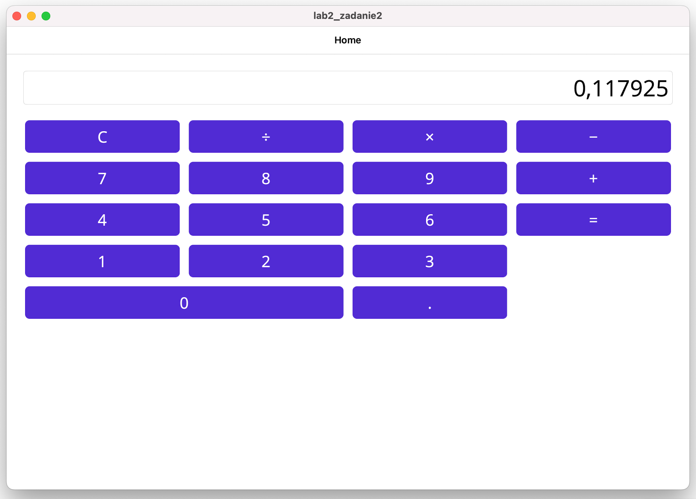
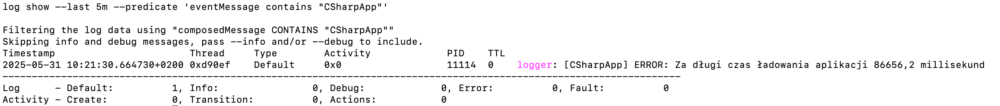

# Nazwa Projektu

Aplikacja z LAB 2 - Zadanie 2.

Wykonana dla macOS Catalyst w .NET MAUI net9.0-maccatalyst (niestety nie posiadam Microsoft Windows).

## Widok aplikacji



## Logi macOS



## Uruchomienie

```
dotnet build -f net9.0-maccatalyst
dotnet run -f net9.0-maccatalyst
```

## Autor

Oliwia Kołacz
